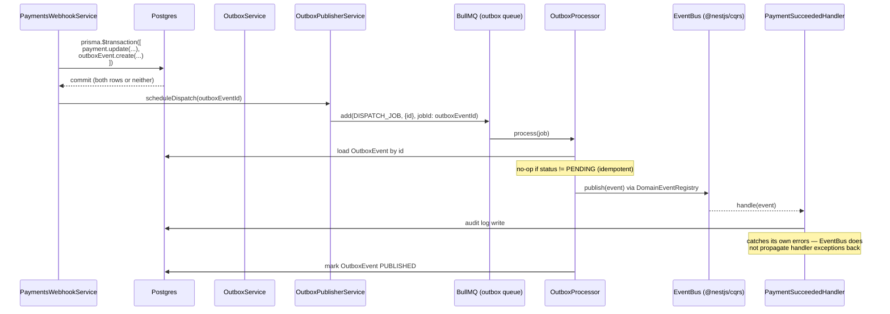
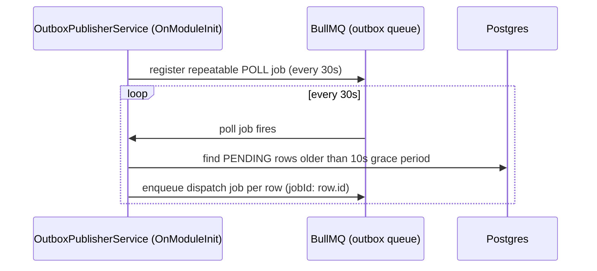
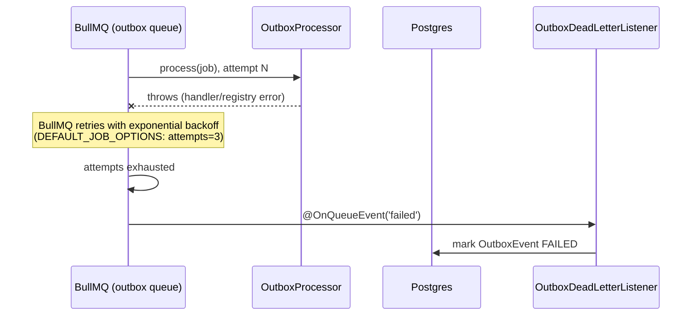
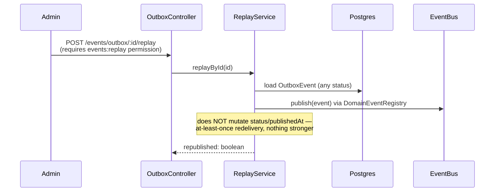
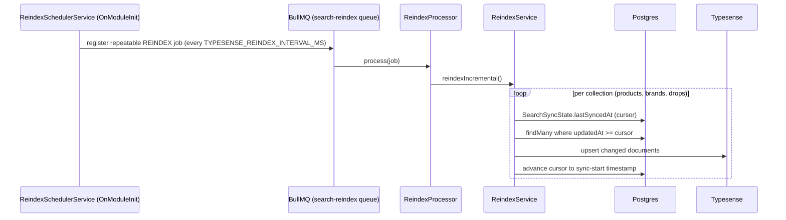

# Event Flow

Diagrams for the domain event / transactional outbox pipeline introduced in
[ADR 0002](adr/0002-domain-events-outbox.md) (whose one reference
integration is the Payments `PAYMENT_SUCCEEDED` event), and the search
incremental-sync pipeline from [ADR 0003](adr/0003-typesense-search-layer.md).

## 1. Publish path (happy path)

## 2. Safety-net poller (fast path missed)

The grace period exists so a row that's mid-fast-path (just committed,
dispatch job about to be enqueued) isn't double-enqueued by the poller
racing it.

## 3. Failure → dead-letter queue

`FAILED` rows are browsable via `GET /events/outbox?status=FAILED` — this
list *is* the dead-letter queue view; there is no separate DLQ table.

## 4. Manual replay

## 5. Search incremental sync (separate pipeline, same "async catch-up" shape)

Not a write-hook (Prisma 6.19 removed `$use()` middleware — see ADR 0003) —
this is a scheduled catch-up, at most one reindex interval of staleness.
